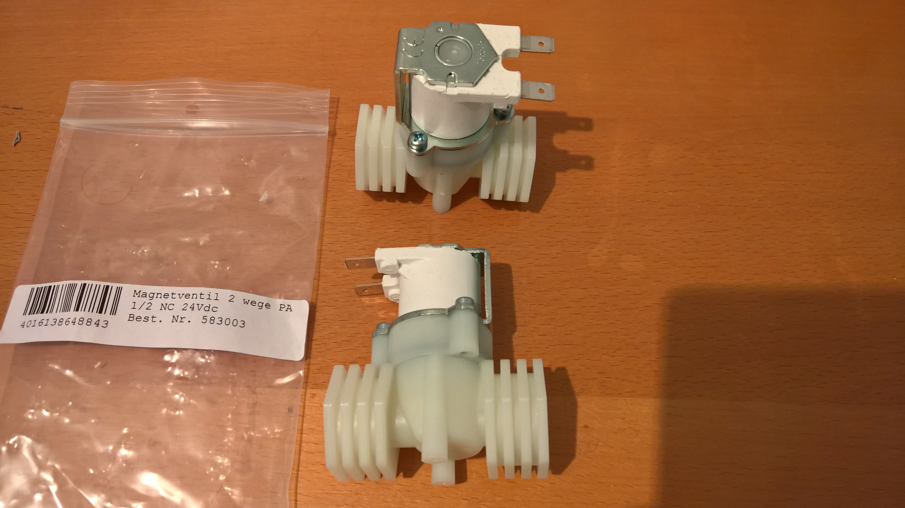
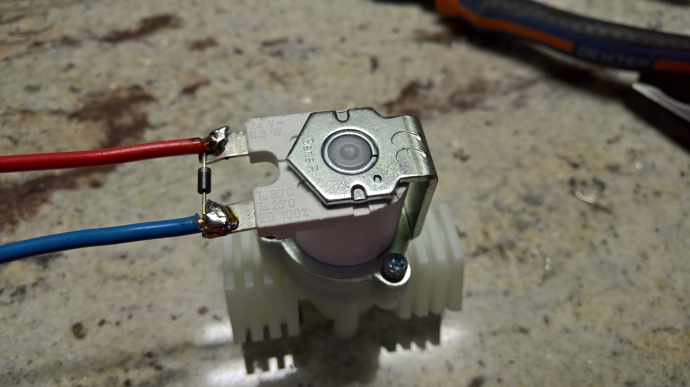
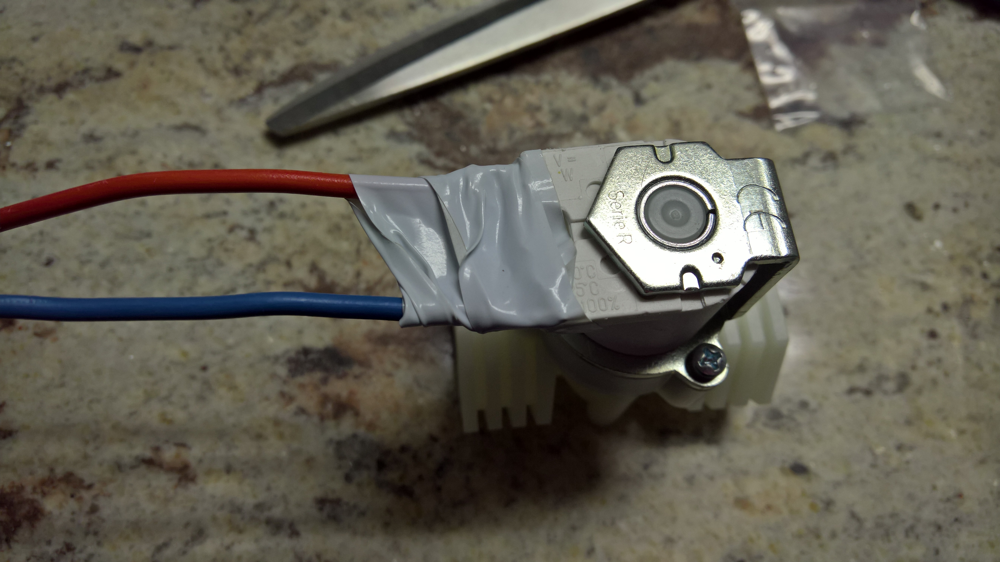
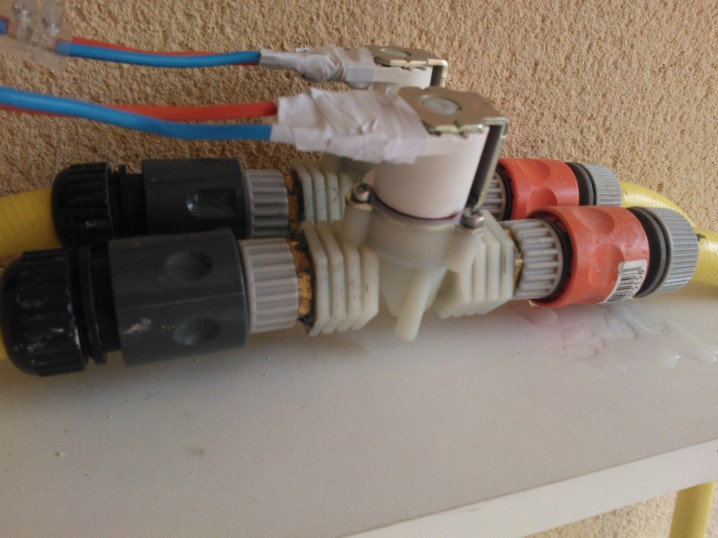
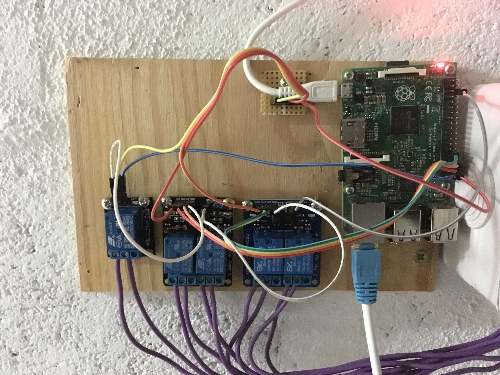

# Windows 10 IoT core Sprinkler system
Manage a real Sprinkler system with a RaspberryPi, all connected to Azure IoT Hub

## Hardware
You need the following hardware:
- 24V transformer with at least at least 2A output (or more or less depending on your electro valves)
- 24V electro valves
- 1 diode per electro valve
- 3.3V Relay

### 24V transformer
You can find easily find the 24V transformer on online shops easily.

### 24V Electro valves
Here are pictures of the electro valves I have at home. They are quite easy to find online.

The diode is used to make sure when the current is stop, the residual current can escape. Just iron it on the electro valves. Some electro valves may already have some.
Add cables as well on your electro valves so you'll be able to cable them on the relay.

Finally, isolate the electro valve’s electric plugs. Electro valves are supposed to be ok to work on wet environment, that said, I recommend to have them in a place where you’ll limit the water.

In my case, I’ve placed them on a spot protected from the rain.


### 3.3V Relay
You can use as many relay as you need. Output pins from Raspberry are:
```
        private const int GPIO_PIN_D0 = 5;
        private const int GPIO_PIN_D1 = 6;
        private const int GPIO_PIN_D2 = 13;
        private const int GPIO_PIN_D3 = 19;
        private const int GPIO_PIN_D4 = 26;
```
So you’ll need to connect the output of each pin to the relay pin entry. Don’t forget as well the 3.3V and the ground.


Here is how it can look like with 5 relay. Note that the code now implement a pin select for the realy alimentation. Pin is GPIO20. The setup files include as well a variable inv0, inv1, etc to be set at 1 if you want an inverted output. If not, then you can ignore. I did this because the group of 2 relay has inverted input. A high level will open the relay, a low one close it. To avoid consume too much energy, I have implemented the capacity to have inversted output and alimenting the relays. In case the rapsberry reboot and the program will not lunch, the relay won't be alimented. So there is no risk of opening them, so no risk of sprinkling indefinitely.


To replace the relay, you can use as well an programmable automate like I did in the past. I no longuer use this setup as the automate stopped working after multiple years.


The project is using the fork from [Restup](https://github.com/Ellerbach/restup "Restup") which is in my repo as well as the [IoT Helpers](https://github.com/Ellerbach/RPI-Win10-Helpers "IoT Helpers") on my repo as well.
